

  

  Collab Shell — Run cloud notebooks, interactive terminals & manage files natively on your phone

  
  
  
  

---

## Download

| Platform | Download | Notes |
| :---: | :---: | :--- |
| 🤖 **Android** |  | Recommended for Android mobile users |

### Android Architecture Build Splits

| Variant | Download | Notes |
| :--- | :---: | :--- |
| 📱 **ARM64** (most phones) | [**collabshell-arm64-v8a.apk**](https://github.com/Nwokike/Collab Shell/releases/latest/download/collabshell-arm64-v8a.apk) | Modern 64-bit Android devices |
| 📱 **ARMv7** (older phones) | [**collabshell-armeabi-v7a.apk**](https://github.com/Nwokike/Collab Shell/releases/latest/download/collabshell-armeabi-v7a.apk) | Legacy 32-bit Android devices |
| 💻 **x86_64** (emulators) | [**collabshell-x86_64.apk**](https://github.com/Nwokike/Collab Shell/releases/latest/download/collabshell-x86_64.apk) | Chromebooks & Android emulators |

---

## Core Capabilities

| Capability | Description |
| :--- | :--- |
| **Interactive PTY Terminal (TTY)** | Real-time live web terminal sessions directly connected via Google Colab's `/api/terminals` WebSocket tunnels. |
| **Tabbed Workspace** | Seamlessly toggle between **Notebook** cell execution and live **Terminal** shell tabs inside active cloud runtimes. |
| **Session Lifecycle Control** | Instantly create, list, restart, and stop active Google Colab sessions directly from your device with smart intent routing. |
| **Hardware Tiers** | Provision CPU (always free), T4 GPU, or TPU v5e/v6e runtimes based on your Google tier limits. |
| **Native OS File Picker & Transfers** | Save downloaded files and archives anywhere on your device via the native OS File Picker without Android storage permission issues. |
| **Folder Zip-and-Download** | Archive and download entire remote directory structures (`/content/folder`) right to your local device with live sweeping progress bars. |
| **Google Drive & GCP Mounts** | Mount your personal Google Drive storage (`/content/drive`) or propagate Google Cloud credentials with real-time execution progress. |
| **Exportable Event Logs** | Maintain universal history profiles (`storage/history/`) and export session logs as Jupyter Notebooks (.ipynb), Markdown (.md), or plain text. |
| **Sandbox Security** | Secure OAuth2 credentials management sandboxed directly on your device storage. |
---

## Screenshots

### Onboarding & Authentication
<table>
  <tr>
    <td width="50%">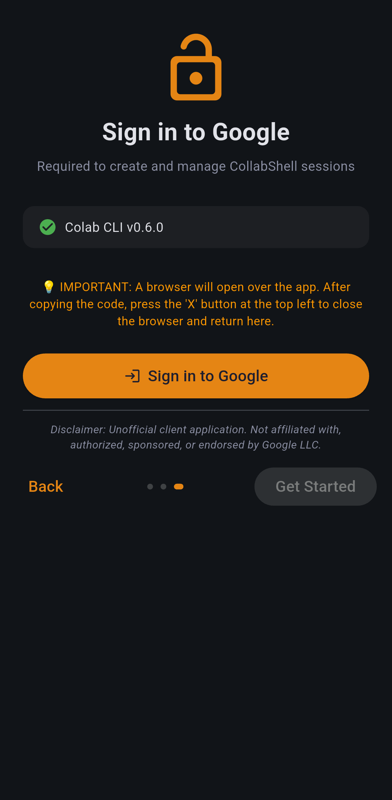</td>
    <td width="50%">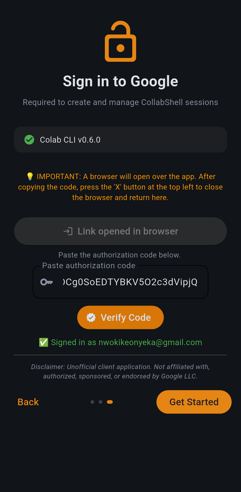</td>
  </tr>
  <tr>
    <td align="center"><em>Google Sign-In Onboarding — native auth guide for managing instances</em></td>
    <td align="center"><em>Verification Flow — OAuth2 verification sandboxed securely on your device</em></td>
  </tr>
</table>

### Dashboard & Navigation
<table>
  <tr>
    <td width="33%">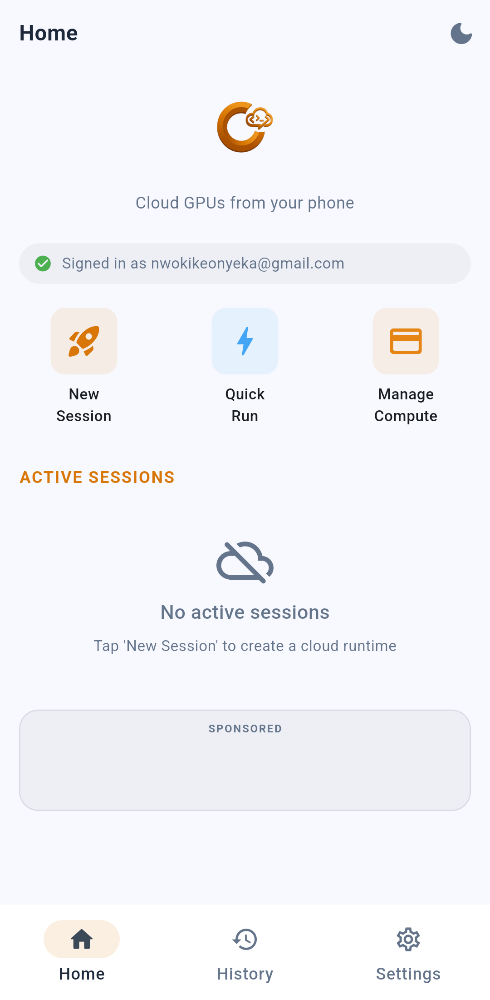</td>
    <td width="33%">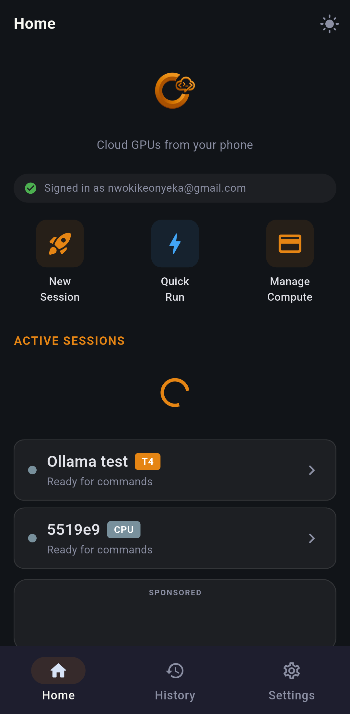</td>
    <td width="33%">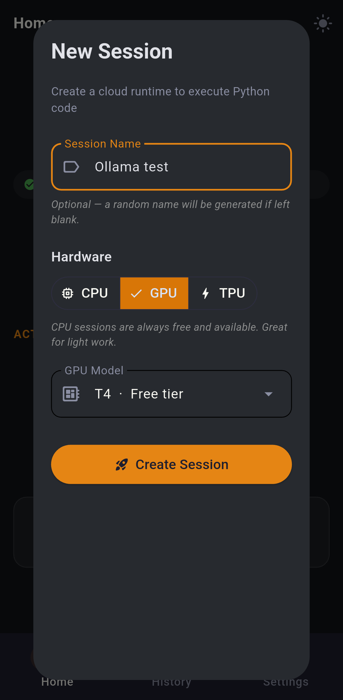</td>
  </tr>
  <tr>
    <td align="center"><em>Home view (Light Theme) — one-click access to all active runtimes</em></td>
    <td align="center"><em>Dashboard (Dark Theme) — list active instances with direct shortcut links</em></td>
    <td align="center"><em>New Session Provisioning — select accelerators (CPU, GPU, TPU) and set run names</em></td>
  </tr>
</table>

### Interactive Notebook & Code Editor
<table>
  <tr>
    <td width="50%">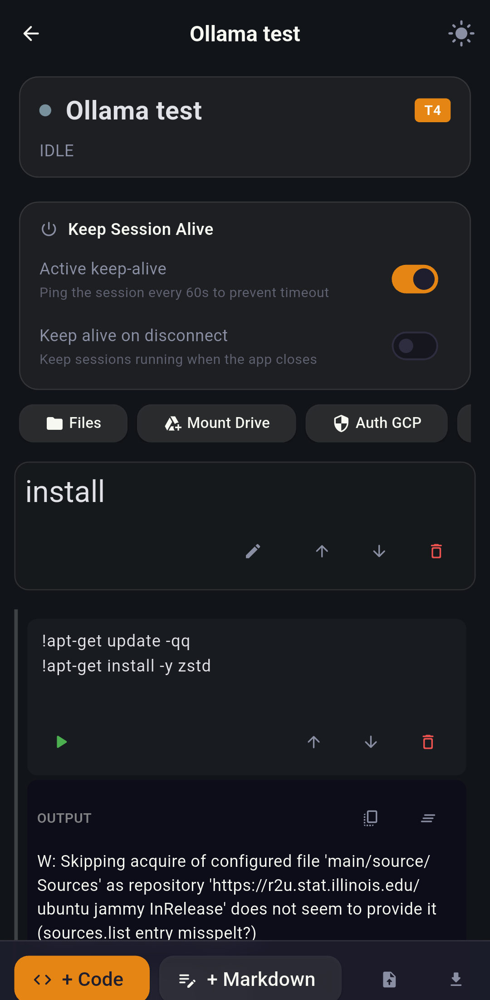</td>
    <td width="50%">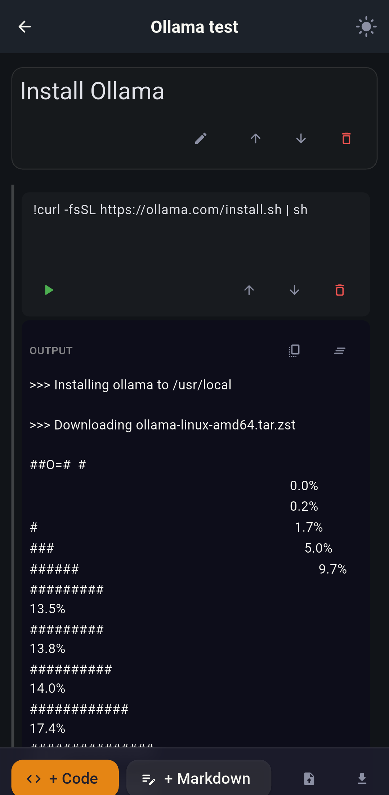</td>
  </tr>
  <tr>
    <td align="center"><em>Interactive Editor — mount Google Drive, toggle keep-alive, and edit code cells</em></td>
    <td align="center"><em>Command execution — run shell scripts natively with real-time progress logging</em></td>
  </tr>
</table>

<table>
  <tr>
    <td width="33%">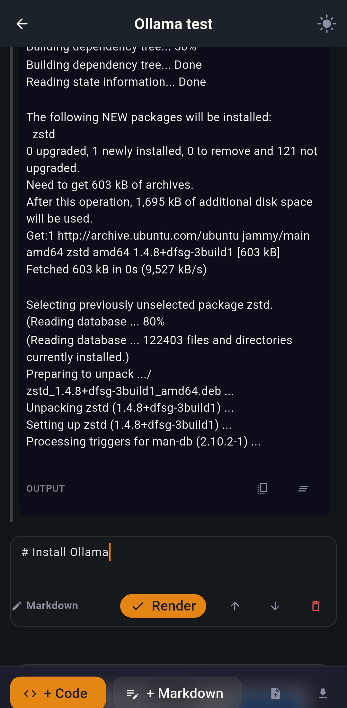</td>
    <td width="33%">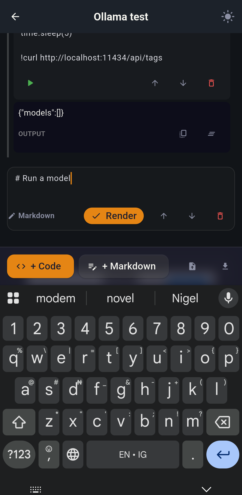</td>
    <td width="33%">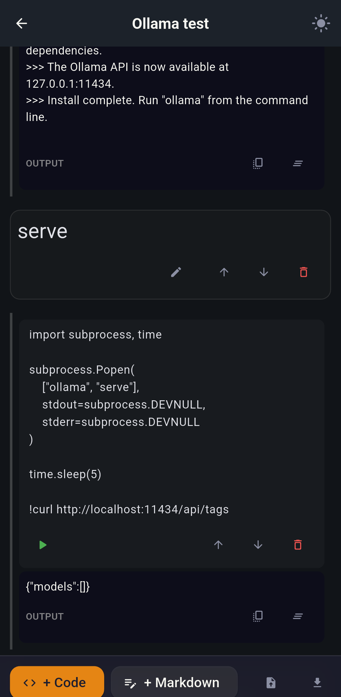</td>
  </tr>
  <tr>
    <td align="center"><em>Rich Markdown editor — write documentation with live render support</em></td>
    <td align="center"><em>Virtual Keyboard Integration — responsive input alignments for mobile screens</em></td>
    <td align="center"><em>Result Output Console — view parsed JSON payloads and execution blocks</em></td>
  </tr>
</table>

### Real-Time Terminal & Remote File Manager
<table>
  <tr>
    <td width="33%"></td>
    <td width="33%"></td>
    <td width="33%"></td>
  </tr>
  <tr>
    <td align="center"><em>Interactive TTY Shell — live real-time bash commands over Colab WebSockets</em></td>
    <td align="center"><em>Remote File Browser — navigate folders, select items, and trigger action bar tools</em></td>
    <td align="center"><em>Native OS Picker & Progress — sweeping progress bars and accurate payload sizes</em></td>
  </tr>
</table>

### History, Settings & Scripts
<table>
  <tr>
    <td width="33%">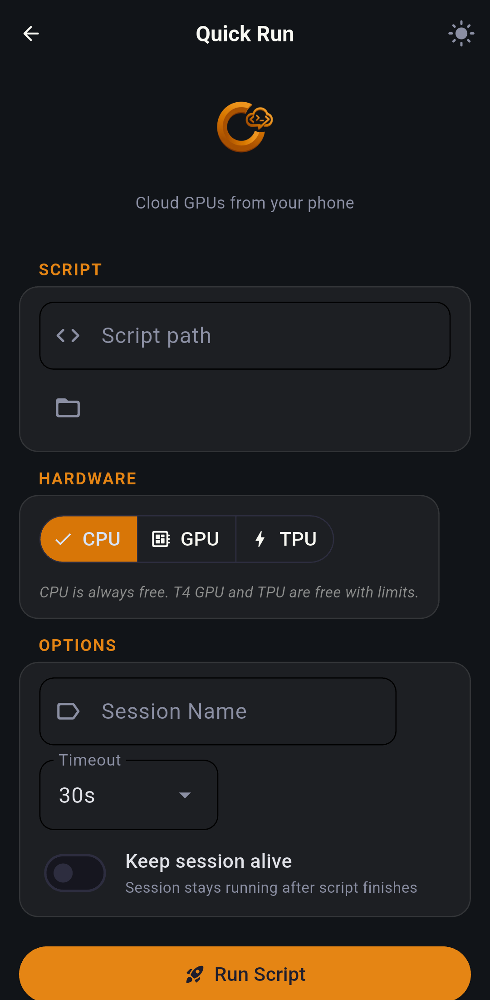</td>
    <td width="33%">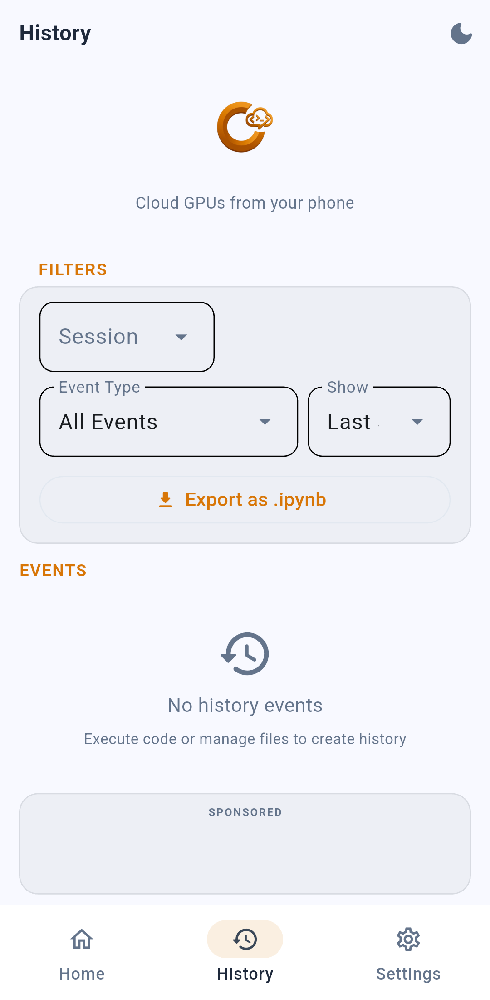</td>
    <td width="33%">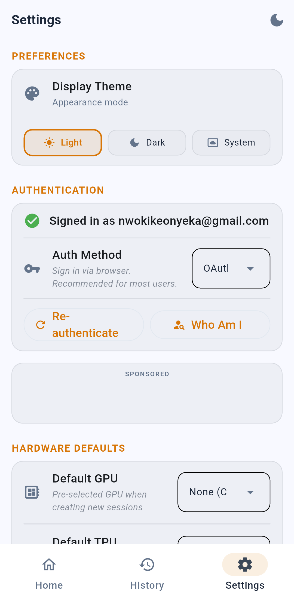</td>
  </tr>
  <tr>
    <td align="center"><em>Quick Run Mode — upload and execute raw scripts in one-shot runtimes</em></td>
    <td align="center"><em>Chronological History — filter, trace, and export session logs to IPYNB</em></td>
    <td align="center"><em>Settings Manager — toggle app themes, customize timeout defaults, and re-authenticate</em></td>
  </tr>
</table>

---

## Features

- **Collab Shell-Branded Design System** — Solarized Light and deep Dark themes styled to the Google Colab branding palette.
- **Interactive TTY Terminal Emulation** — Dedicated PTY terminal engine connecting directly to Colab WebSocket endpoints (`/api/terminals`).
- **Universal Storage & History Normalization** — Monkey-patched backend state persistence (`storage_patch.py`) guaranteeing history and execution logs save reliably across Android and Linux desktops.
- **Native OS File Picker & Zip-and-Download** — Save files anywhere on your OS/Android device without permission headaches, and archive entire cloud folders on the fly.
- **Dynamic Onboarding Guide** — 3-step walk-through onboarding introducing features with gesture-swipe controls.
- **Preloaded Interstitial Ads** — Intelligent Google AdMob integration displaying ads seamlessly on mobile platforms.
- **Non-Blocking Execution** — Asynchronous connection wrappers ensuring the Flet UI stays fully responsive during long remote computations.
- **Ruff Compliance** — Clean, formatted, and strictly linted Python codebase.

---

## Architecture

| Layer | Technology | Purpose |
| :--- | :--- | :--- |
| **Frontend** | Flet | Cross-platform UI with responsive views and smooth page transitions |
| **Client Service** | `google-colab-cli` SDK | Wrapper for Colab session management and code execution |
| **Local Database** | Flat JSON Storage (`storage.json`) | Key-value store for app settings, theme state, and credentials |
| **Auth Provider** | Google OAuth2 | Secure user authentication to manage personal Google Cloud instances |

### Visual Flow

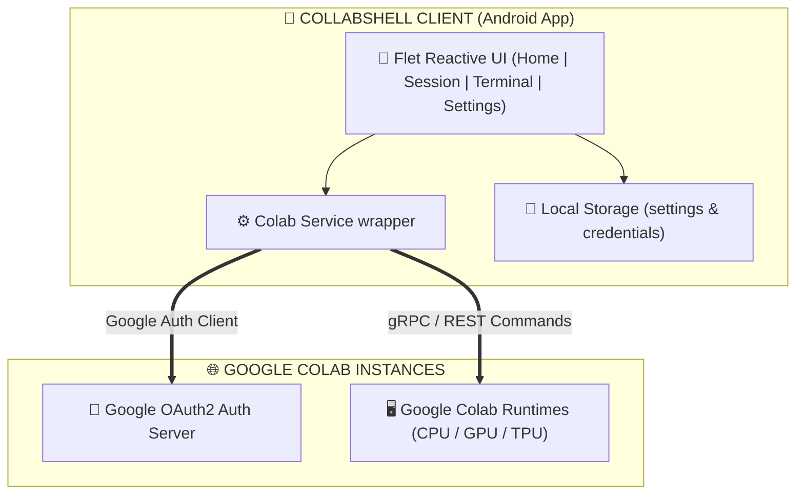

---

## Privacy & Security

Collab Shell is designed with a strict **Privacy-First** philosophy:

1. **Direct VM Connections**: All commands, file accesses, and script executions are sent directly to Google Colab. No intermediate proxy.
2. **Zero Metadata Tracking**: We do not trace, log, or collect your code, file lists, or Google account credentials.
3. **Device Sandboxing**: Local settings and tokens are kept in secure application directories.
4. **Data Sovereignty**: Saved logs and exports reside 100% locally in your device Downloads folder.

---

## Legal Disclaimer

Collab Shell is an independent Flet-based client application wrapping the Google Colab CLI and is not affiliated with, authorized, maintained, sponsored, or endorsed by Google LLC, Google Colaboratory, or any of its affiliates. 

Users are responsible for complying with Google Colab's Terms of Use, resource usage policies, and local data protection regulations. The authors are not responsible for any issues resulting from Google account suspensions or resource limits.
