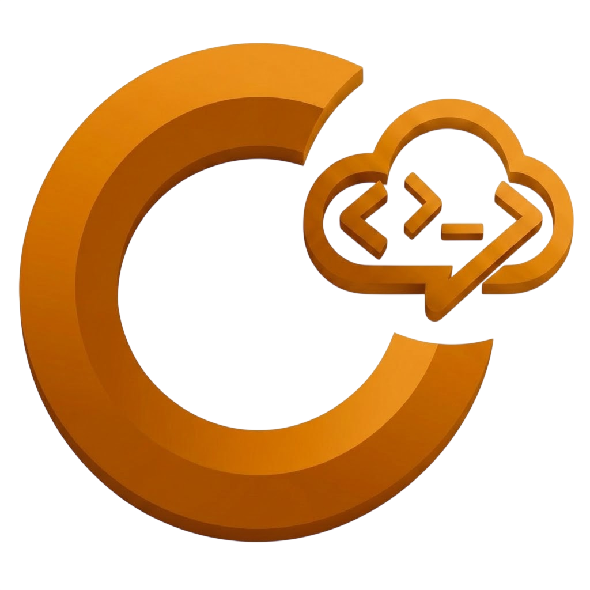
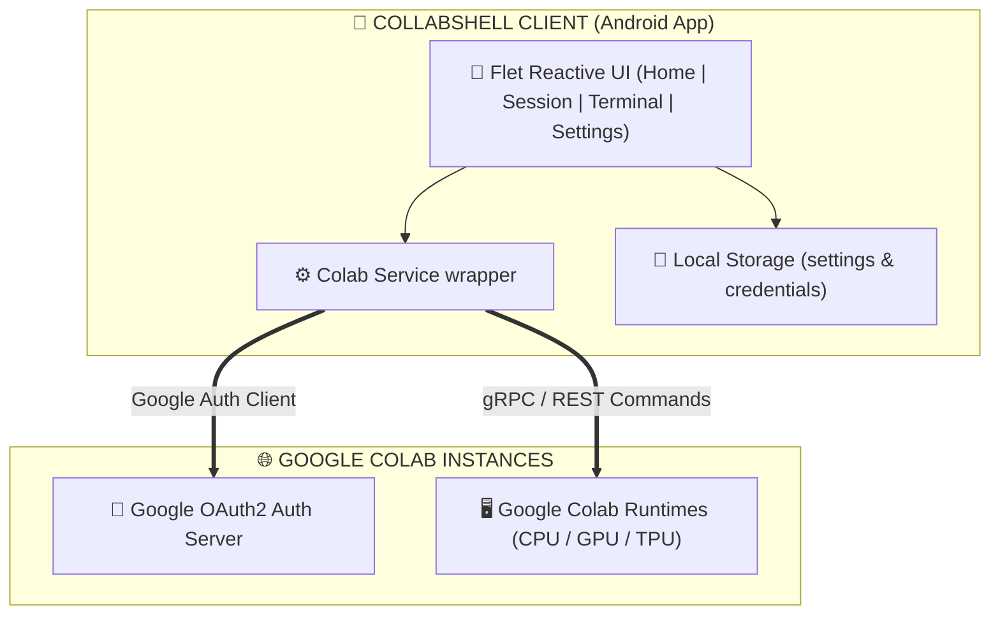

  

  CollabShell — Manage and run Google Colab sessions directly from your phone with native TPU and GPU control

  
  
  
  

---

## Download

| Platform | Download | Notes |
| :---: | :---: | :--- |
| 🤖 **Android** |  | Recommended for Android mobile users |

### Android Architecture Build Splits

| Variant | Download | Notes |
| :--- | :---: | :--- |
| 📱 **ARM64** (most phones) | [**collabshell-arm64-v8a.apk**](https://github.com/Nwokike/CollabShell/releases/latest/download/collabshell-arm64-v8a.apk) | Modern 64-bit Android devices |
| 📱 **ARMv7** (older phones) | [**collabshell-armeabi-v7a.apk**](https://github.com/Nwokike/CollabShell/releases/latest/download/collabshell-armeabi-v7a.apk) | Legacy 32-bit Android devices |
| 💻 **x86_64** (emulators) | [**collabshell-x86_64.apk**](https://github.com/Nwokike/CollabShell/releases/latest/download/collabshell-x86_64.apk) | Chromebooks & Android emulators |

---

## Core Capabilities

| Capability | Description |
| :--- | :--- |
| **Session Lifecycle Control** | Instantly create, list, restart, and stop active Google Colab sessions directly from your device. |
| **Hardware Tiers** | Provision CPU (always free), T4 GPU, or TPU v5e/v6e runtimes based on your Google tier limits. |
| **Interactive Terminal** | Run Python scripts and interactive code blocks on the remote VM with a full console output viewer. |
| **Google Drive Mounts** | Mount your personal Google Drive storage to the remote virtual machine for persistent datasets. |
| **Package Installer** | Fast pip and uv package installation directly on the remote instance. |
| **Exportable Event Logs** | Maintain history profiles and export session logs as Jupyter Notebooks (.ipynb), Markdown (.md), or plain text. |
| **Sandbox Security** | Secure OAuth2 credentials management sandboxed on your device storage. |

---

## Features

- **CollabShell-Branded Design System** — Solarized Light and deep Dark themes styled to the Google Colab branding palette.
- **Dynamic Onboarding Guide** — 3-step walk-through onboarding introducing features with gesture-swipe controls.
- **Preloaded Interstitial Ads** — Intelligent Google AdMob integration displaying ads seamlessly on mobile platforms.
- **Non-Blocking Execution** — Asynchronous connection wrappers ensuring the Flet UI stays fully responsive during long remote computations.
- **Ruff Compliance** — Clean, formatted, and strictly linted Python codebase.

---

## Architecture

| Layer | Technology | Purpose |
| :--- | :--- | :--- |
| **Frontend** | Flet (Flutter engine) | Cross-platform UI with responsive views and smooth page transitions |
| **Client Service** | `google-colab-cli` SDK | Wrapper for Colab session management and code execution |
| **Local Database** | Flat JSON Storage (`storage.json`) | Key-value store for app settings, theme state, and credentials |
| **Auth Provider** | Google OAuth2 | Secure user authentication to manage personal Google Cloud instances |

### Visual Flow

---

## Privacy & Security

CollabShell is designed with a strict **Privacy-First** philosophy:

1. **Direct VM Connections**: All commands, file accesses, and script executions are sent directly to Google Colab. No intermediate proxy.
2. **Zero Metadata Tracking**: We do not trace, log, or collect your code, file lists, or Google account credentials.
3. **Device Sandboxing**: Local settings and tokens are kept in secure application directories.
4. **Data Sovereignty**: Saved logs and exports reside 100% locally in your device Downloads folder.

---

## Legal Disclaimer

CollabShell is an independent Flet-based client application wrapping the Google Colab CLI and is not affiliated with, authorized, maintained, sponsored, or endorsed by Google LLC, Google Colaboratory, or any of its affiliates. 

Users are responsible for complying with Google Colab's Terms of Use, resource usage policies, and local data protection regulations. The authors are not responsible for any issues resulting from Google account suspensions or resource limits.
