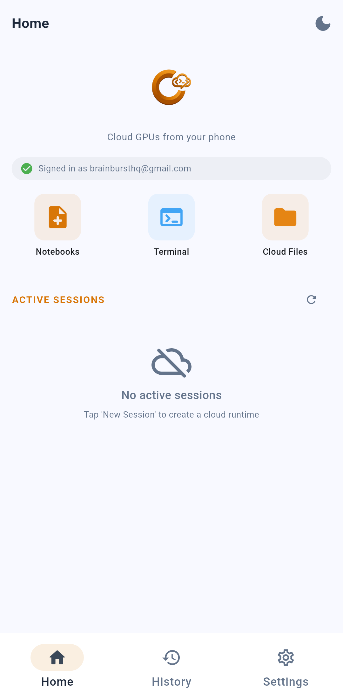
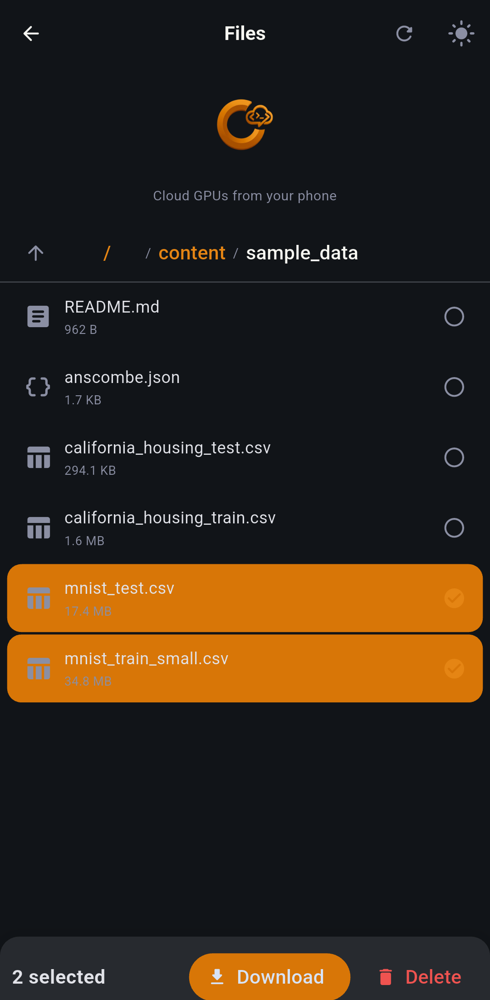
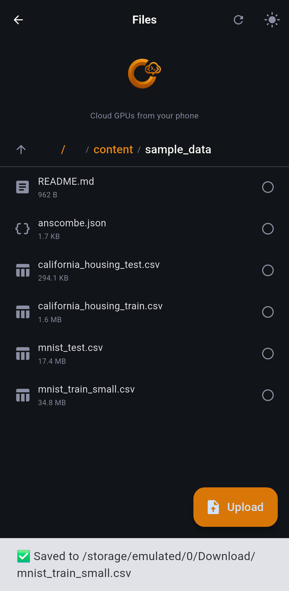
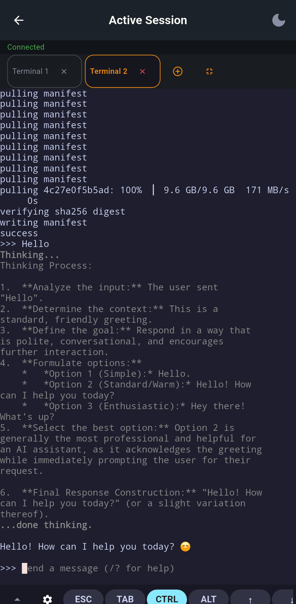
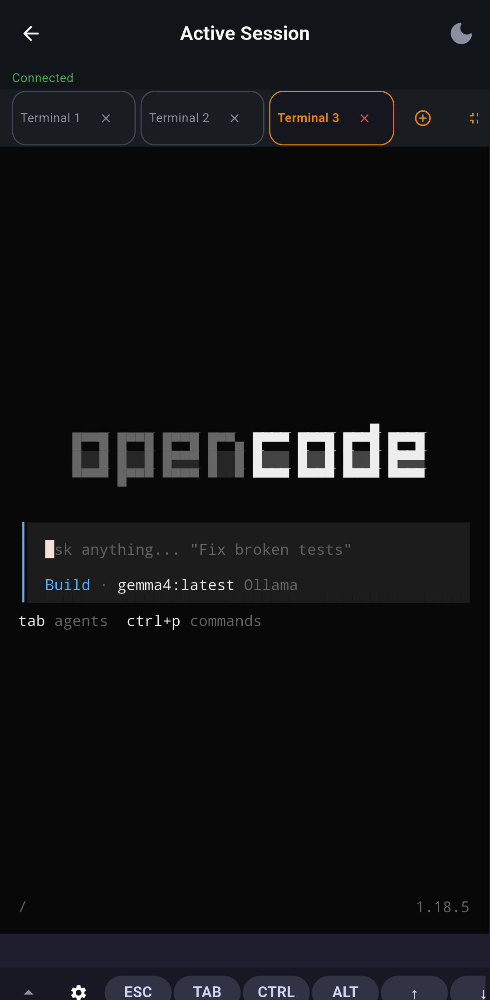
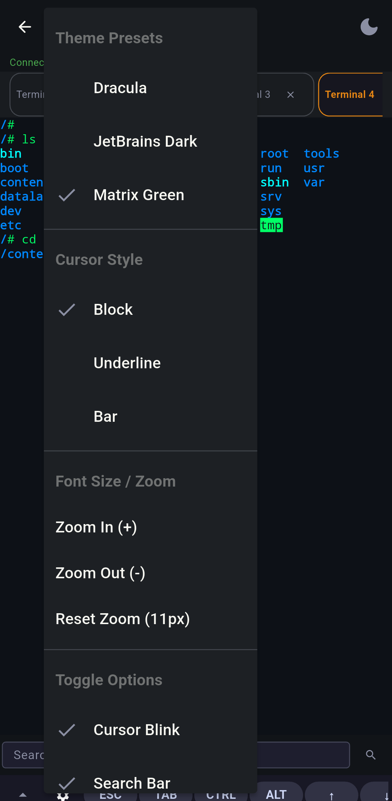
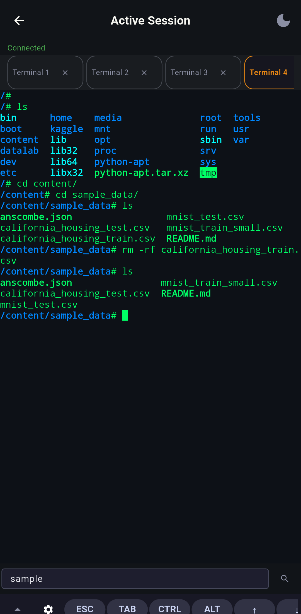
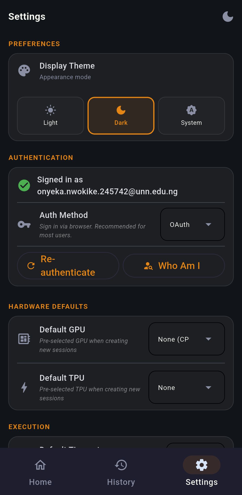

  

  Collab Shell — Run cloud notebooks, interactive terminals & manage files natively on your phone

  
  
  
  
  
  

---

## Download

| Platform | Download | Notes |
| :---: | :---: | :--- |
| 🤖 **Android** |  | Recommended for Android mobile users |
| 🪟 **Windows** |  | Automated standalone setup installer with desktop shortcut integration |
| 🐧 **Linux (Debian/Ubuntu)** |  | Desktop package tailored for Ubuntu, Debian, Linux Mint & Pop!_OS |
| 🎩 **Linux (Fedora/RHEL)** |  | Desktop package tailored for Fedora, openSUSE, RHEL & CentOS |
| 📦 **Linux (Universal Portable)** |  | Universal standalone portable archive for Arch, Alpine, Steam Deck & all distros |

### Android Architecture Build Splits

| Variant | Download | Notes |
| :--- | :---: | :--- |
| 📱 **ARM64** (most phones) | [**collabshell-arm64-v8a.apk**](https://github.com/Nwokike/CollabShell/releases/latest/download/collabshell-arm64-v8a.apk) | Modern 64-bit Android devices |
| 📱 **ARMv7** (older phones) | [**collabshell-armeabi-v7a.apk**](https://github.com/Nwokike/CollabShell/releases/latest/download/collabshell-armeabi-v7a.apk) | Legacy 32-bit Android devices |
| 💻 **x86_64** (emulators) | [**collabshell-x86_64.apk**](https://github.com/Nwokike/CollabShell/releases/latest/download/collabshell-x86_64.apk) | Chromebooks & Android emulators |

---

## 🌟 The Three Core Features

Collab Shell is engineered around three foundational pillars for remote cloud computing on mobile and desktop:

### 1. 📓 Interactive Jupyter Notebook Engine
- **Code Execution**: Execute Python code cells with real-time streaming stdout/stderr console outputs.
- **Rich Markdown Editing & Live Rendering**: Write documentation with LaTeX math equations, code blocks, and formatted text. Render live Markdown with a single tap.
- **Keep-Alive Service**: Maintain active execution sessions without losing state when switching apps.

### 2. 💻 Real-Time PTY Interactive Terminal (TTY)
- **Colab WebSocket Tunnels**: Direct low-latency PTY connection via Google Colab's `/api/terminals` WebSocket endpoints.
- **Full LLM & TUI Support**: Run local AI models (`ollama run llama3`), AI coding assistants (`opencode`), and full interactive terminal TUIs directly in your cloud runtimes.
- **Multi-Tab & Theme Customization**: Open multiple concurrent terminal tabs, customize themes (Matrix Green, Dracula, JetBrains Dark), cursor styles, and search terminal output.

### 3. 📁 Remote File Manager
- **Native OS File Browsing & Transfers**: Browse remote cloud filesystem paths (`/content`, `/content/sample_data`, `/content/drive`) with full breadcrumb navigation.
- **Native Device Downloads & Uploads**: Download remote files directly to your device (`/storage/emulated/0/Download`) with toast confirmations, or upload local files with a tap.
- **Bulk Operations & Zip Archives**: Select multiple files for bulk download or deletion, and archive entire directory structures into `.zip` packages on the fly.

---

## 📸 Visual Tour & Screenshots

### Onboarding & Security Verification
<table>
  <tr>
    <td width="50%"></td>
    <td width="50%"></td>
  </tr>
  <tr>
    <td align="center"><em>Google Sign-In Onboarding — native auth guide for managing instances</em></td>
    <td align="center"><em>Verification Flow — OAuth2 credentials sandboxed securely on your device</em></td>
  </tr>
</table>

### Dashboard & Session Provisioning
<table>
  <tr>
    <td width="33%"></td>
    <td width="33%"></td>
    <td width="33%"></td>
  </tr>
  <tr>
    <td align="center"><em>Initial Dashboard (Light Theme) — clean starting view for creating cloud instances</em></td>
    <td align="center"><em>Session Provisioning — select hardware accelerators (CPU, GPU, TPU v5e/v6e)</em></td>
    <td align="center"><em>Active Runtimes Dashboard (Dark Theme) — manage live instances with direct shortcuts</em></td>
  </tr>
</table>

### 1. 📓 Interactive Notebook & Markdown Engine
<table>
  <tr>
    <td width="33%"></td>
    <td width="33%"></td>
    <td width="33%"></td>
  </tr>
  <tr>
    <td align="center"><em>Notebook Workspace — mount Google Drive, toggle keep-alive, and manage code cells</em></td>
    <td align="center"><em>Live Rendered Markdown — write formatted documentation and tap to edit or preview</em></td>
    <td align="center"><em>Streaming Code Console — view instant real-time execution outputs line-by-line</em></td>
  </tr>
</table>

### 2. 📁 Remote File Manager
<table>
  <tr>
    <td width="50%"></td>
    <td width="50%"></td>
  </tr>
  <tr>
    <td align="center"><em>Remote File Manager — breadcrumb navigation, multi-select files for bulk Download & Delete</em></td>
    <td align="center"><em>Native Download & Upload — save files directly to device Downloads folder with toast alerts</em></td>
  </tr>
</table>

### 3. 💻 Interactive PTY Terminal & AI TUI Execution
<table>
  <tr>
    <td width="50%"></td>
    <td width="50%"></td>
  </tr>
  <tr>
    <td align="center"><em>Ollama LLM Execution — run open-weight AI models live inside Colab TTY terminal</em></td>
    <td align="center"><em>OpenCode AI Coding Assistant — interactive terminal TUI with full soft-key controls</em></td>
  </tr>
</table>

### Terminal Customization & App Settings
<table>
  <tr>
    <td width="33%"></td>
    <td width="33%"></td>
    <td width="33%"></td>
  </tr>
  <tr>
    <td align="center"><em>Terminal Customization — select themes (Dracula, Matrix Green), cursor styles & zoom</em></td>
    <td align="center"><em>Matrix Green Theme — customized TTY styling with built-in output search bar</em></td>
    <td align="center"><em>Settings Manager — toggle app themes, inspect Activity Terminal logs & re-authenticate</em></td>
  </tr>
</table>

---

## 🛠️ Architecture

| Layer | Technology | Purpose |
| :--- | :--- | :--- |
| **Frontend** | Flet (Flutter engine) | Cross-platform reactive UI with smooth page transitions |
| **Client Service** | `google-colab-cli` SDK | Client wrapper for Google Colab session management & execution |
| **Local Database** | Flat JSON Storage (`storage.json`) | Key-value store for app settings, theme state, and credentials |
| **Auth Provider** | Google OAuth2 | Secure user authentication to manage personal Google Cloud instances |

---

## 🔒 Privacy & Security

Collab Shell is designed with a strict **Privacy-First** philosophy:

1. **Direct VM Connections**: All commands, file accesses, and script executions are sent directly to Google Colab. No intermediate proxy.
2. **Zero Metadata Tracking**: We do not trace, log, or collect your code, file lists, or Google account credentials.
3. **Device Sandboxing**: Local settings and tokens are kept in secure application directories.
4. **Data Sovereignty**: Saved logs and exports reside 100% locally in your device Downloads folder.

---

## ⚖️ Legal Disclaimer

Collab Shell is an independent Flet-based client application wrapping the Google Colab CLI and is not affiliated with, authorized, maintained, sponsored, or endorsed by Google LLC, Google Colaboratory, or any of its affiliates. 

Users are responsible for complying with Google Colab's Terms of Use, resource usage policies, and local data protection regulations. The authors are not responsible for any issues resulting from Google account suspensions or resource limits.
